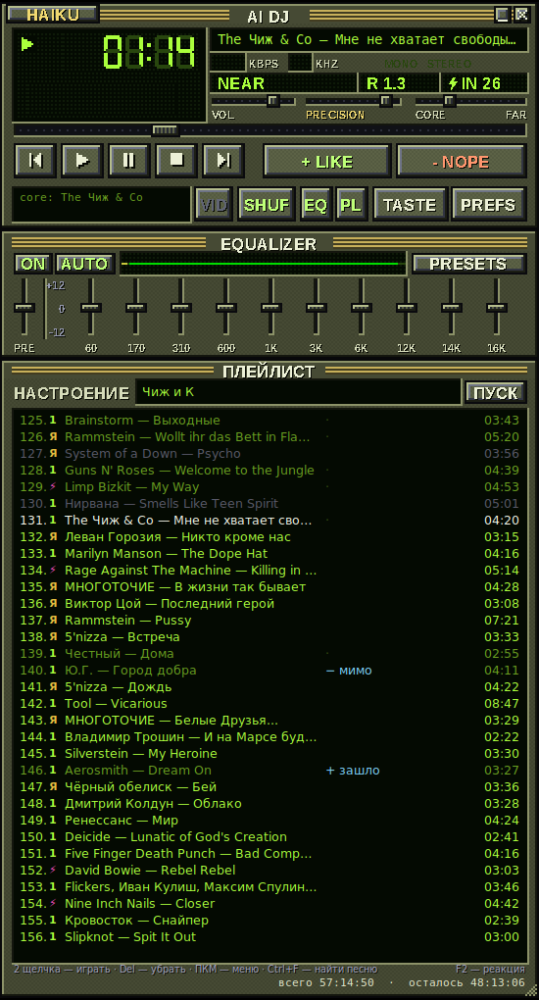
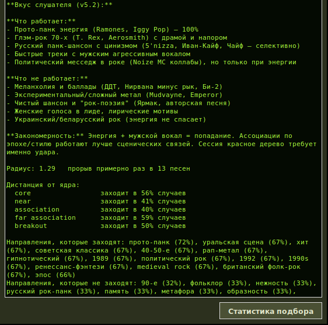
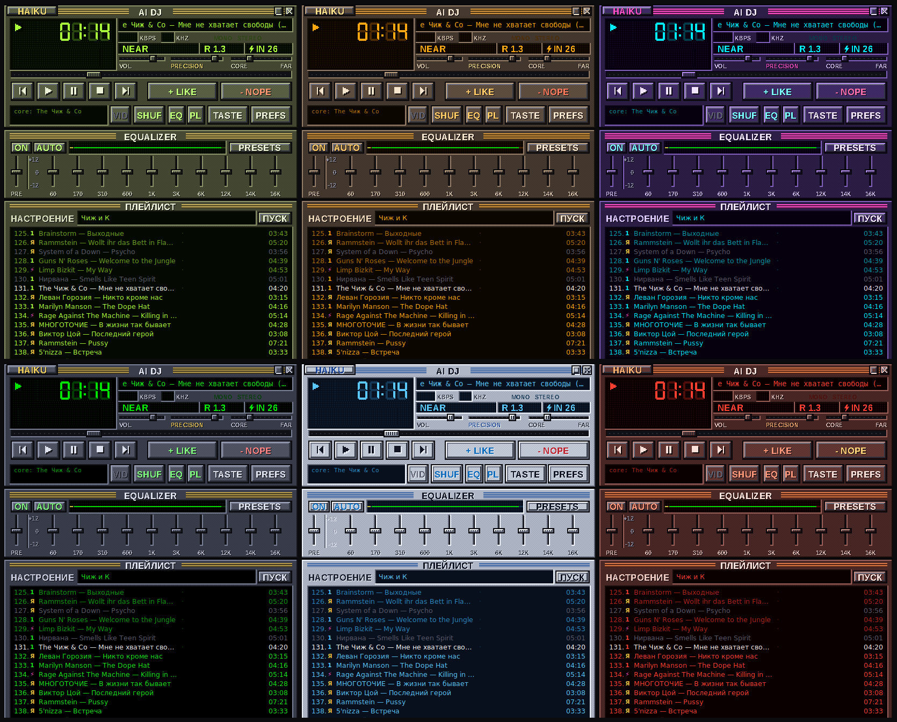

# AI DJ

**Выглядит как Winamp — но это не Winamp.** Плеер без фонотеки: опишите настроение словами, и нейросеть соберёт плейлист, включит его с YouTube или VK Видео и будет учиться на ваших пропусках и лайках.

**Looks like Winamp — but it isn't.** A player with no library: describe a mood in plain words, an LLM builds the playlist, plays it from YouTube or VK Video and learns from your skips and likes.

## Скачать · Download

**[Последняя версия для Windows → Releases](../../releases/latest)** · сайт: [ai-dj.ysamussenko.workers.dev](https://ai-dj.ysamussenko.workers.dev)

Бесплатно. Windows. Обновления ставятся сами.

## Что умеет

- **Плейлист из одной фразы** — «ночная трасса, дождь, что-то как Кино, но не Кино».
- **Вспоминает забытое и находит новое** — нейросеть достаёт песни, о которых вы забыли; музыкальный каталог приносит то, чего нейросеть не знает.
- **Учится по ходу** — пропуск в первые секунды, лайк, короткая реакция словами меняют следующую подборку.
- **Начинает узко, расширяется с опытом** — первые песни близко к названным исполнителям, дальше поиск шире, пока попадания держатся.
- **Окно вкуса** — что вам заходит и что нет, словами и в цифрах.
- **Бесконечный плейлист** — песни кончились, диджей подбирает ещё; без настроения — по вашему вкусу.
- **Поиск конкретной песни** — Ctrl+F, по названию или по ссылке на ролик YouTube / VK.
- **YouTube или VK Видео** — где YouTube не грузится, музыка идёт с VK.
- **Шесть скинов на лету**, эквалайзер, сохранение и открытие плейлистов M3U8.
- **Статистика расхода** — сколько песен, токенов и денег ушло на каждую модель (Ctrl+I).

## Нейросети

Свой ключ к одной из: Claude, GPT, DeepSeek, Qwen или GLM Flash — он бесплатный. На 1000 подобранных песен: Claude Haiku — $3,97 по счётчику токенов, DeepSeek — $0,22–0,43 по расчёту, GLM Flash — бесплатно.

## Как устроено

Python + Tkinter, воспроизведение — mpv, потоки — yt-dlp и VK Видео, теги и каталог — Deezer API.

---

Вопросы и ошибки — во вкладку [Issues](../../issues).
